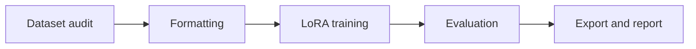

# Fine-tune Lab

 

**Small experiments. Traceable decisions.**

面向 LoRA 微调、数据治理和模型评估的实验设计仓库。当前发布研究蓝图，训练代码、权重与实验结果尚未发布。

## Planned experiment lifecycle

| Track | Planned artifact |
|---|---|
| Data | Licensed examples, schema checks and held-out split |
| Training | Versioned configuration and seed |
| Evaluation | Base model vs fine-tuned model on the same test set |
| Reproducibility | Hardware, memory, runtime and dependency versions |

## Technology references

[Transformers](https://github.com/huggingface/transformers) · [PEFT](https://github.com/huggingface/peft) · [MLflow](https://github.com/mlflow/mlflow)

## Milestones

- [ ] Select a small base model and licensed dataset
- [ ] Publish a reproducible LoRA configuration
- [ ] Run baseline and tuned-model evaluation
- [ ] Publish experiment report and export instructions

Model and data licenses will be recorded alongside each experiment. No performance improvement is claimed at this stage.
