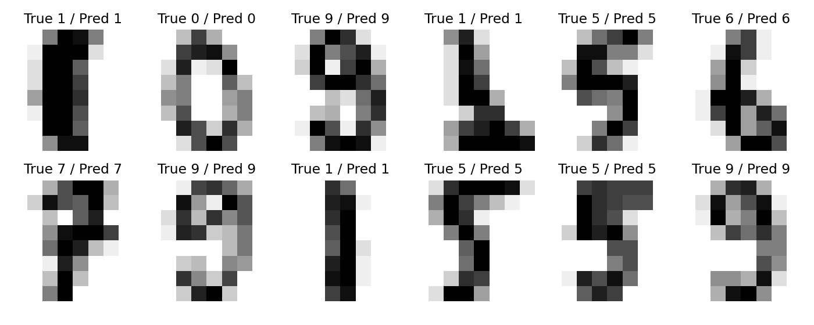
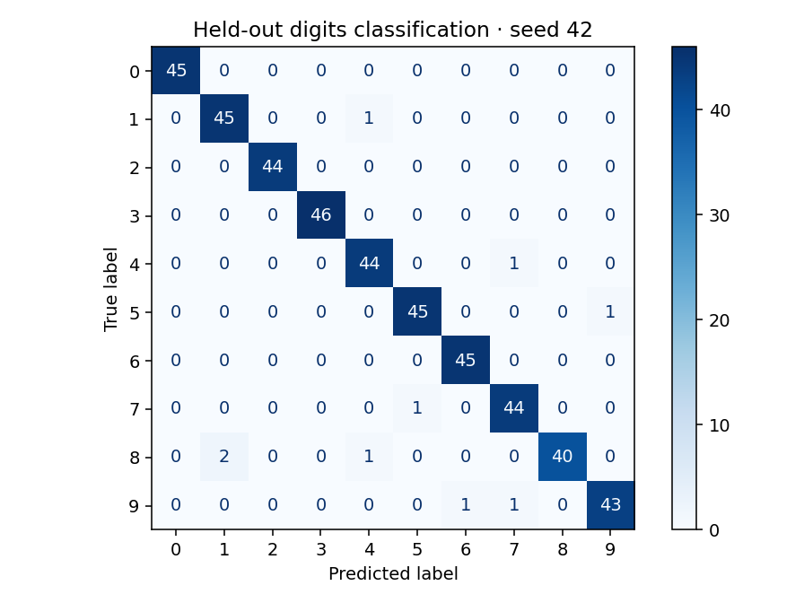
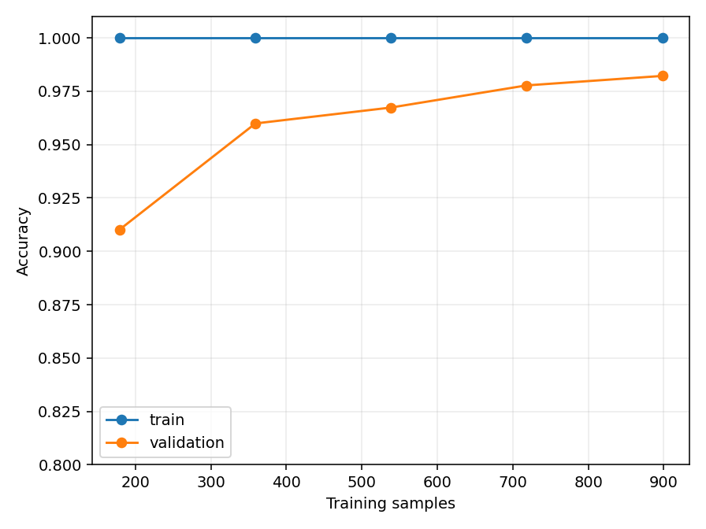

# Fine-tune Lab

> 可复现的 CPU 模型训练与评估基线








## What runs today

当前实现 StandardScaler + SVM 手写数字分类训练、DummyClassifier 对照、分层训练/测试划分、五折交叉验证、学习曲线、混淆矩阵与模型导出。保留仓库名称；当前不是 LoRA 或大模型微调。缩放器仅在训练集拟合，测试集不参与调参。

## Quick start

```bash
git clone https://github.com/foxviot/finetune-lab.git
cd finetune-lab
python -m pip install -r requirements.txt
python train.py
```

## Custom input

```text
python train.py --seed 42 --output results
```

## Measured result

固定种子 42，训练 1347 张、留出测试 450 张。该次 CPU 运行：

| Model | Test accuracy |
|---|---:|
| Most-frequent baseline | 10.22% |
| StandardScaler + SVC | 98.00% |

完整逐类指标见 [metrics.json](results/metrics.json)，实际测试依赖版本见 [tested-versions.txt](tested-versions.txt)。本结果仅针对内置 8×8 手写数字数据集，不代表自然图像或大模型性能。

## Results and limits

样例输出来自实际运行。速度随硬件与依赖版本变化；示例结果不代表生产环境性能。默认运行不需要 API Key、GPU 或云服务。

## Attribution

详见 [ATTRIBUTION.md](ATTRIBUTION.md)。复用 scikit-learn（BSD-3-Clause）的数据接口与算法，训练编排与报告脚本为本仓库新增。模型文件只应从可信来源加载。

本仓库新增代码采用 [MIT](LICENSE)，依赖库和数据保持各自许可证。本项目不代表上游官方项目。
